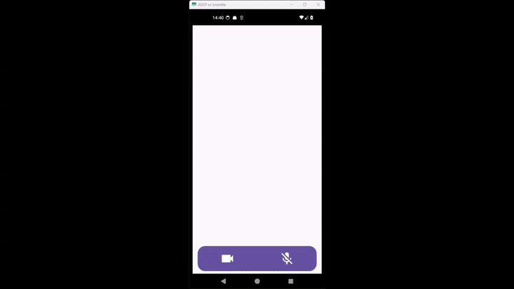
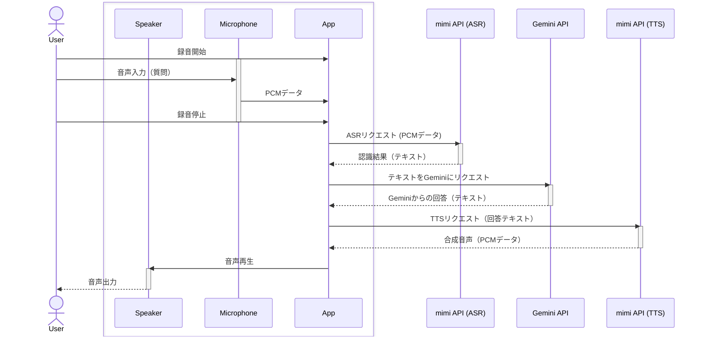

# mimi AiChat
Compose Multiplatform で作成した 音声AiChatアプリ  
[mimi API](https://mimi.fairydevices.jp/) と [Gemini API](https://ai.google.dev/gemini-api/docs?hl=ja) を用いて、  
デバイスのマイクから録音した音声を音声認識（ASR）し、Geminiにリクエストし、  
Geminiからの結果を 音声合成（TTS）し、デバイスのスピーカー等で再生します。  
また、mimi APIには、[mimi.client.kotlin](https://github.com/FairyDevicesRD/mimi.client.kotlin) を利用します。



## サポート

|        | Android(SDK 26+) | iOS(15.6+) |
| ------ | :--------------: | :------: |
| mimi   |        ✅️         |    ✅️     |
| 通信   |        ✅️         |    ✅️     |
| マイク |        ✅️         |    ✅️     |
| カメラ |        ✅️         |    ⚠️     |

> [!WARNING]
> iOSは、カメラの動作確認が十分ではありません。  
> iPad(MY252J/A) OS:18　では動いています。iPhone6S(A1688) OS:15 では動作不十分です。

## データの流れ


## 主なライブラリ
- [mimi.kotlin.client](https://github.com/FairyDevicesRD/mimi.client.kotlin)
- [metro](https://github.com/ZacSweers/metro)
- [BuildKonfig](https://github.com/yshrsmz/BuildKonfig)
- [moko-permissions](https://github.com/icerockdev/moko-permissions)
- [ktor](https://github.com/ktorio/ktor)
- [ktorfit](https://github.com/Foso/Ktorfit)
- [napier](https://github.com/AAkira/Napier)
- [kotlin-result](https://github.com/michaelbull/kotlin-result)

## ビルド
少し手順が複雑です。ここではAndroid向けのみ記載します。
### 1. リポジトリ取得
Git submoduleを使いますので、`recursive` が必須です。
```sh
git clone --recursive <this Repository URL>
```
### 2. `mimi.client.kotlin` のビルドとローカルPublish
mimi.client.kotlin は、KMPで構成されていますが、すべてのPlatformをPublishしていません。  
そこで、事前にローカルでビルドし、ローカル上にPublishしておきます。
```sh
cd <this repository>/library/mimi.kotlin
# ビルドに必要な空ファイルを作成
touch github.properties local.properties
# 以下のスクリプトを実行。
```

> [!WARNING]
> mimi.kotlin.client 直下にある [`publish.sh`](https://github.com/FairyDevicesRD/mimi.client.kotlin/blob/main/publish.sh) とは微妙に異なる点に注意下さい。

```sh
#!/bin/bash
list=(
    ":engine:core"
    ":engine:ktor"
    ":engine:okhttp"
    ":service:token"
    ":service:asr-core"
    ":service:asr"
    ":service:nict-asr"
    ":service:nict-tts"
    ":utils"
)
for task in "${list[@]}"; do
    ./gradlew "$task":publishToMavenLocal

    if [ $? -ne 0 ]; then
        echo "エラー: $task の実行に失敗しました"
        exit 1
    fi

    echo "完了: $task"
    echo "------------------------"
done
```
成功すると、Windowsなら、`C:\Users\<UserName>\.m2\repository`、Linuxなら、`$HOME/.m2/repository` にmimi.kotlin.clientが、展開されます。
### 3. `secrets.properties` の作成
`secrets.properties.sample` を参考に、プロジェクトのルートに `secrets.properties` を作成します。
```properties
# mimi api https://mimi.readme.io/docs/firststep-auth/ を読み、発行します。
# スコープは、最低限 音声認識と、音声合成が必要です。
mimiApplicationId=<mimi application Id>
mimiClientId=<mimi client Id>
mimiClientSecret=<mimi client Secret>

# Gemini Developer API https://ai.google.dev/gemini-api/docs?hl=ja を読み、発行します。
geminiApiKey=<gemini api key>
# 自作のダミーサーバーに変える場合に利用します
geminiEndpoint=https://generativelanguage.googleapis.com/
# モデルを変える場合はこちらを更新します
geminiModel=gemini-2.5-flash
```

### 4. Androidアプリビルド（Debugインストール）
```sh
cd <this repository>
./gradlew :androidApp:installDebug
```

## THINKLET向け
THINKLET向けに調整したバージョンは、以下でインストール可能です。実行前にPermissionの許可は行ってください。

```sh
cd <this repository>
./gradlew :thinkletApp:installDebug
```

### THINKLET向け版の使い方
第２ボタンを短く押し、効果音が再生されたら、質問をします。  
もう一度第２ボタンを短く押し、効果音が再生されたら、質問に使う写真撮影と質問のための録音を停止します。  
その後、Geminiからの応答があれば音声で再生されます。
